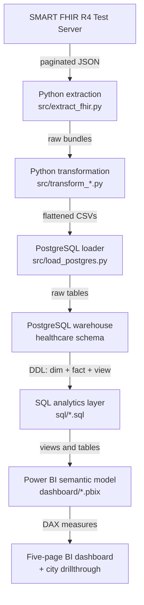
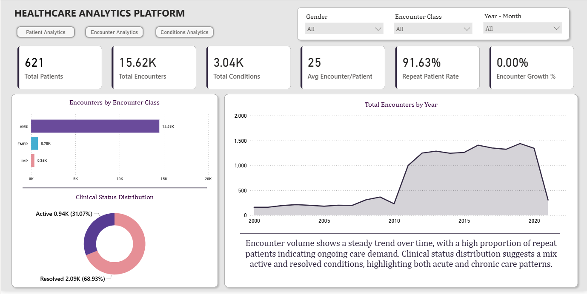
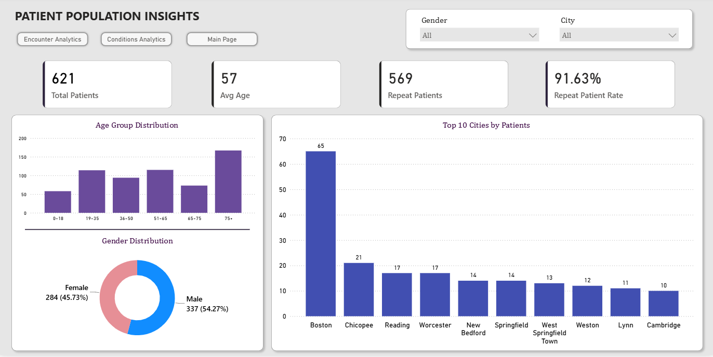
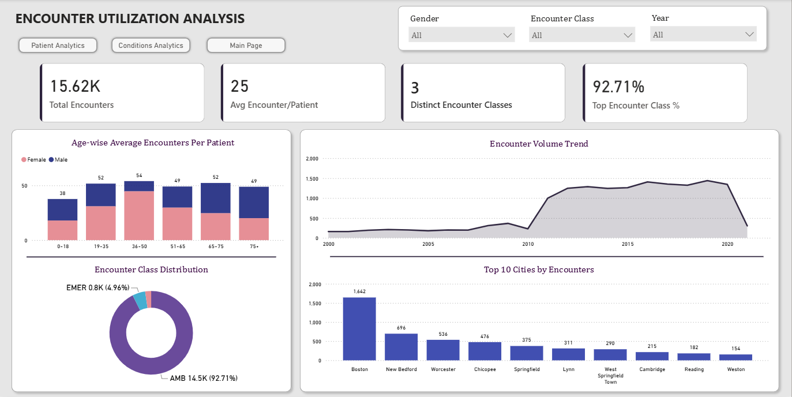
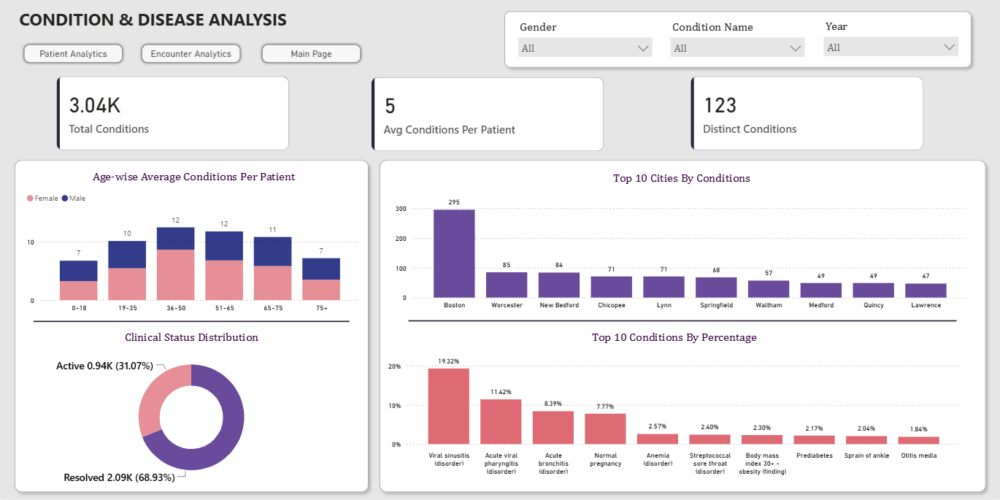
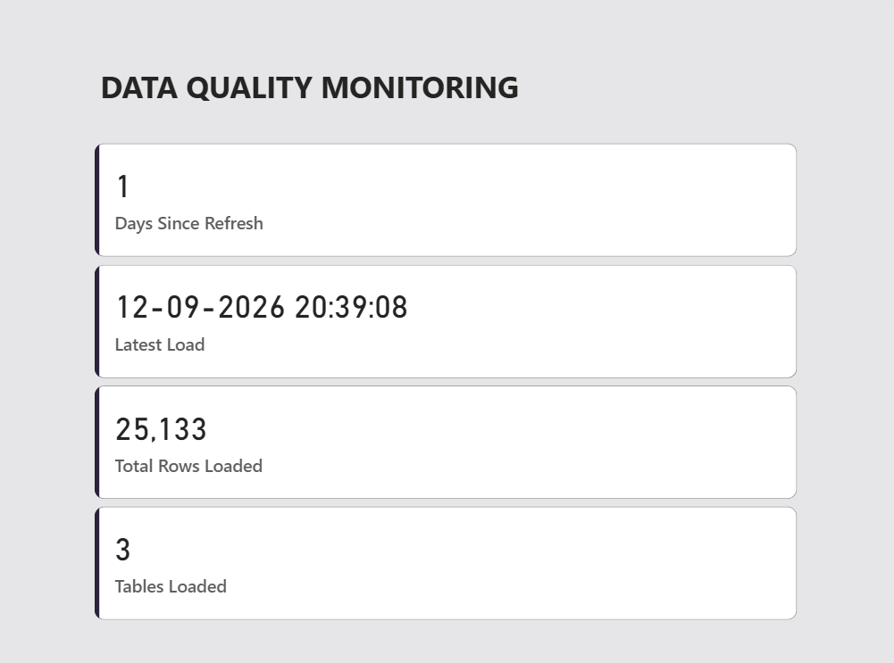
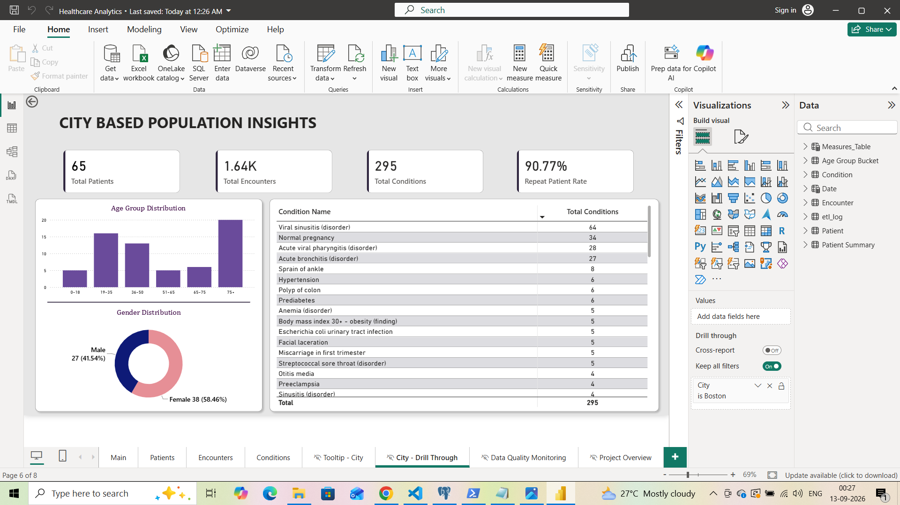

# Healthcare Analytics Pipeline and BI Dashboard

An end-to-end analytics project that retrieves **public synthetic FHIR data**,
flattens nested clinical records into analysis-ready tables, loads them into a
PostgreSQL warehouse, validates data quality, and presents operational insights
through a Power BI report.

This is a portfolio project. The data is synthetic and the results are for
demonstration only. **Nothing in this repository should be used for clinical
decision-making.**

---

## Business problem

Healthcare operations teams need a consistent view of patient population,
encounter demand, frequently recorded conditions, and the reliability of the
underlying data. Answering those questions usually requires stitching together
several disjoint systems.

This project builds a small, end-to-end pipeline that turns raw FHIR resources
into an analytics-ready warehouse and an interactive dashboard. It answers
questions such as:

- How is encounter volume changing over time?
- Which encounter classes account for the most utilization?
- How concentrated is utilization across patients?
- Which conditions are recorded most frequently?
- Are identifiers, relationships, and dates complete enough to trust the
  results?

---

## Architecture



| Layer | Tools |
|---|---|
| Extraction | Python, `requests` |
| Transformation | Python, `pandas` |
| Warehouse | PostgreSQL, SQL |
| Analytics | SQL (CTEs, window functions, rolling aggregates) |
| Semantic model | Power BI, DAX |
| Visualization | Power BI report (5 pages + drillthrough) |
| Configuration | `python-dotenv`, `.env` |

---

## Data model

The warehouse lives in the `healthcare` schema and follows a small dimensional
design. Three main objects carry the analytical load.

| Object | Grain | Purpose |
|---|---|---|
| `healthcare.dim_patient` | One row per patient | Demographics and location attributes |
| `healthcare.fact_encounter` | One row per encounter | Class, status, and encounter timestamps |
| `healthcare.fact_condition` | One row per condition record | Recorded condition and clinical status |
| `healthcare.etl_log` | One row per load event | Load time and row count per table |
| `healthcare.vw_patient_summary` | One row per patient | Encounter and condition counts for BI |

**Relationships:** `fact_encounter.patient_id` and `fact_condition.patient_id`
reference `dim_patient.patient_id`. `fact_condition.encounter_id` references
`fact_encounter.encounter_id` when the FHIR resource supplies one.

The model is a **small dimensional schema**, not a full star: `fact_condition`
references a second fact table, which is a snowflake-style link rather than a
strict star pattern. This is a deliberate choice so the project can express the
"condition occurred during an encounter" relationship without adding a bridge
table.

---

## Dashboard

The report has five analytical pages and one drillthrough page. Each screenshot
below reflects the same documented snapshot described under **Results**.

### Executive Overview



Population size, total encounters, total conditions, average utilization, repeat-
patient rate, and encounter growth. Designed as the starting point before
drilling into a specific view. A high repeat-patient rate indicates that most
recorded activity comes from returning patients rather than one-time visits.

### Patient Population Insights



Who appears in the data and how heavily they use the system. The age-group
distribution shows a bimodal shape with peaks among working-age adults and the
75+ group. Comparing the average and median encounters per patient (shown on
other pages) reveals that a small group of patients accounts for a
disproportionate share of activity.

### Encounter Utilization Analysis



When encounters occurred and how they are distributed by class. Ambulatory
encounters dominate, so changes in the overall trend should be read as changes
in outpatient activity rather than equal movement across all care settings. The
volume trend shows a sharp acceleration after 2008 followed by a stable plateau
from 2011 onward.

### Condition & Disease Analysis



Recorded conditions ranked by frequency, with a clinical-status breakdown.
A high recorded count means a condition appears frequently in *these records*.
It does **not** measure population prevalence, severity, or treatment outcome.

### Data Quality Monitoring



Load freshness and row counts pulled from `healthcare.etl_log`. This page tracks
*when* data arrived and *how much* arrived - it is the operationally visible
side of the pipeline.

### City Population Insights (drillthrough)



Right-click drillthrough from the Patient Population page. Shows city-scoped
patient counts, encounter counts, condition counts, repeat-patient rate, and a
ranked condition list. This demonstrates filtered drillthrough in the semantic
model.

---

## Results from the documented snapshot

The numbers below come from a single run of the pipeline against the public
SMART FHIR test server. The server is mutable, so **re-running the pipeline
later may produce slightly different counts**. Treat these as a documented
snapshot, not as a fixed property of the source.

### Warehouse counts (all dates)

| Measure | Value |
|---|---:|
| Patients | 621 |
| Encounters | 19,811 |
| Conditions | 4,701 |
| Average encounters per patient | 31.9 |
| Repeat-patient count | 621 |

### Dashboard-visible counts (2000+ filter)

The Power BI semantic model filters encounters and conditions to records with
`start_date > 2000-01-01`. The synthetic FHIR server contains a sparse
historical backfill going back to 1914, and including those scattered early
records distorts time-based trends. The dashboard therefore reports the
recent window:

| Measure | Value |
|---|---:|
| Patients (unfiltered) | 621 |
| Encounters (2000+) | ~15,620 |
| Conditions (2000+) | ~3,040 |
| Average encounters per patient (2000+) | 25 |
| Repeat-patient rate | ~91.6% |
| Distinct encounter classes | 3 |

### Repeat-utilization distribution (all dates)

| Band | Patients | Total encounters | Avg per patient |
|---|---:|---:|---:|
| 1 encounter | 0 | 0 | - |
| 2–5 encounters | 3 | 12 | 4.0 |
| 6–20 encounters | 276 | 3,919 | 14.2 |
| 21+ encounters | 342 | 15,880 | 46.4 |

**Interpretation:** 342 of 621 patients (55%) fall in the 21+ band and account
for roughly 80% of recorded encounters. This is the classic high-utilization
tail that operations teams monitor. It is a descriptive finding only - it says
nothing about why these patients return, or whether the returns are clinically
appropriate.

### Top recorded conditions

| Rank | Condition | Records |
|---:|---|---:|
| 1 | Viral sinusitis (disorder) | 659 |
| 2 | Acute viral pharyngitis (disorder) | 379 |
| 3 | Acute bronchitis (disorder) | 282 |
| 4 | Normal pregnancy | 260 |
| 5 | Body mass index 30+ – obesity (finding) | 206 |

### Data quality

Every relational-integrity check passed on this snapshot:

| Check | Result |
|---|---|
| Duplicate patient, encounter, or condition IDs | 0 |
| Encounters without a matching patient | 0 |
| Conditions without a matching patient | 0 |
| Missing encounter start dates | 0 |
| End dates earlier than start dates | 0 |
| Missing gender, birth date, or state | 0 |
| Missing condition name or onset date | 0 |

FHIR treats several of those fields as optional. Reporting zero missing values
here means the source records happen to be complete in this snapshot, not that
missing values are always an error.

---

## Repository structure

```text
healthcare-analytics/
├── dashboard/
│   └── Healthcare Analytics.pbix
├── data/
│   ├── README.md
│   ├── raw/fhir/.gitkeep
│   └── processed/fhir/.gitkeep
├── docs/
│   └── SQL_WALKTHROUGH.md
├── screenshots/
│   ├── city_population_insights.png
│   ├── condition_analysis.png
│   ├── data_quality.png
│   ├── encounter_analytics.png
│   ├── executive_overview.png
│   ├── patient_analytics.png
│   └── project_overview.png
├── sql/
│   ├── analytics_queries.sql
│   ├── analytics_view_patients_summary.sql
│   ├── create_schema.sql
│   ├── data_quality_checks.sql
│   ├── etl_log.sql
│   ├── staging_layer_condition.sql
│   ├── staging_layer_encounter.sql
│   └── staging_layer_patient.sql
├── src/
│   ├── extract_fhir.py
│   ├── load_postgres.py
│   ├── run_pipeline.py
│   ├── transform_condition.py
│   ├── transform_encounter.py
│   └── transform_patient.py
├── .env.example
├── .gitignore
├── LICENSE
├── README.md
└── requirements.txt
```

Generated JSON and CSV files are excluded from Git. See
[`data/README.md`](data/README.md) for the data policy.

---

## Setup

### 1. Prerequisites

- Python 3.10 or newer
- PostgreSQL 14 or newer
- Power BI Desktop (to open the `.pbix` report)

### 2. Create and activate a virtual environment

```bash
python -m venv .venv
```

On Windows:

```powershell
.\.venv\Scripts\Activate.ps1
```

On macOS or Linux:

```bash
source .venv/bin/activate
```

### 3. Install dependencies

```bash
python -m pip install --upgrade pip
pip install -r requirements.txt
```

### 4. Configure PostgreSQL

Create a local database:

```bash
psql -U postgres -c "CREATE DATABASE healthcare_analytics;"
```

Copy `.env.example` to `.env` and fill in your local credentials:

```
DB_USER=postgres
DB_PASSWORD=your_local_password
DB_HOST=localhost
DB_PORT=5432
DB_NAME=healthcare_analytics
DB_SCHEMA=healthcare
FHIR_PAGE_SIZE=200
```

The repository does not contain any passwords. `.env` is excluded by
`.gitignore`.

### 5. Run the pipeline

```bash
python src/run_pipeline.py
```

This runs, in order:

1. **Extract** - pull Patient, Encounter, and Condition bundles from the public
   SMART FHIR test server. This may take **5–20 minutes** depending on server
   responsiveness because the pipeline follows every paginated link.
2. **Transform** - flatten each bundle into a CSV in `data/processed/fhir/`.
3. **Load** - insert the CSVs into PostgreSQL in the `healthcare` schema.

### 6. Build the warehouse

Run these scripts in PostgreSQL in this order:

1. `sql/create_schema.sql`
2. `sql/etl_log.sql`
3. `sql/staging_layer_patient.sql`
4. `sql/staging_layer_encounter.sql`
5. `sql/staging_layer_condition.sql`
6. `sql/analytics_view_patients_summary.sql`
7. `sql/data_quality_checks.sql`
8. `sql/analytics_queries.sql`

The business meaning of the analytical SQL is explained in
[`docs/SQL_WALKTHROUGH.md`](docs/SQL_WALKTHROUGH.md).

### 7. Open the Power BI report

Open `dashboard/Healthcare Analytics.pbix`. If prompted, update the PostgreSQL
connection to point at your local `healthcare_analytics` database and the
`healthcare` schema. Then click **Refresh** to reload from your local warehouse.

---

## Data quality

`sql/data_quality_checks.sql` is designed so that **zero rows returned means the
check passed**. It covers:

- Duplicate primary identifiers.
- Encounters or conditions without a matching patient.
- Missing encounter start dates.
- End dates earlier than start dates.
- Missing optional demographic and condition fields.

Missing values are reported, not automatically treated as errors. Many FHIR
fields are optional, and the analyst decides whether a missing field excludes a
record from a specific KPI. Details are in
[`docs/SQL_WALKTHROUGH.md`](docs/SQL_WALKTHROUGH.md).

---

## Limitations

- The source is a **public synthetic FHIR test server**, not real patient data.
  Nothing in this project is clinically valid.
- The source is **mutable**. Two runs of the same pipeline a week apart may
  produce different row counts. The numbers in this README describe one
  documented snapshot.
- The pipeline performs a **full refresh** on each run. It is not an incremental
  ETL and it does not version the raw data.
- The Power BI report filters encounters and conditions to records from 2000
  onward. The pre-2000 records exist in the warehouse but are excluded from the
  semantic model because they are sparse historical backfill that distorts time
  trends.
- Condition counts describe **recorded documentation**, not disease prevalence.
- The 30-day repeat-encounter query is an **operational utilization screen**,
  not a validated clinical readmission metric.
- The pipeline is a **local, sequential runner**. It does not include
  scheduling, orchestration, retries, or cloud deployment.

---

## Future enhancements

- Add automated Python and SQL tests to a CI workflow.
- Support incremental extraction using FHIR resource `lastUpdated` timestamps.
- Introduce orchestration and retry monitoring with a scheduler such as
  Apache Airflow.
- Version the raw FHIR bundles so results can be reproduced against a fixed
  snapshot.
- Add encounter-cost or length-of-stay measures where suitable source fields
  become available.
- Publish the semantic model and report through a governed Power BI workspace.

---

## Author

**Rutuja Kadam** - M.Sc. Statistics | Data and BI Analyst

SQL · Python · PostgreSQL · Power BI · DAX · ETL · Dimensional Modelling
